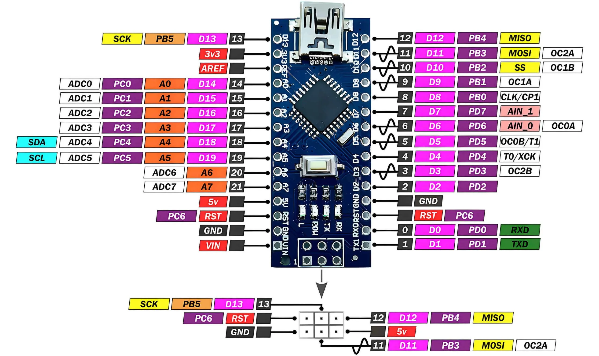

# ATMega328P Shell

## Overview
This is a program that can be run from the terminal, with the simple aim of being able to change the behaviour of the Arduino Nano, containing the ATmega328P microcontroller, without losing time (whether it be 5 seconds or minutes!). This is a simple demonstration, but future implementations may focus on auxiliary features such as saving the current configurations for ease of use. But those are future works.

## Installation and Setup

## Commands

The shell commands a 3 or 4 argument input: 
```
action, object, arg_1, arg_2
```

The `arg_1` position only refers to the following reference image. Note that only the black boxed numbers are implemented. Addition of the other pin names are in the works.


The following `actions` are available: 
- `read` which  allows you to view the value being input to the pin
- `set` allows you to choose the function of the pin 
- `write` allows you to choose the output/settings of the pin

ie. The following example: 
`set pin 7 1` = Set the following pin on the Nano, Pin 7 (or D7), to high (1). Alternatively, this could also be written equivalently as `set pin d7 high`.


## Key Learnings
This is a project to focus on mastering simple and key concepts in bare metal programming, specifically in C. This includes:
- GPIO mapping
- UART, ADC and PWM implementation
- Memory management

## Future Implementations
